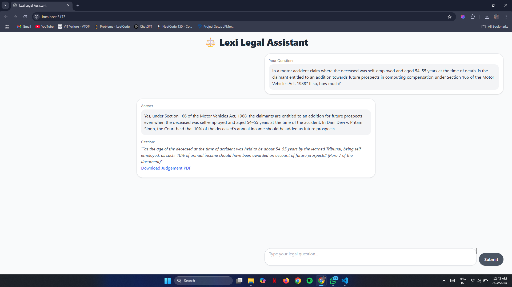
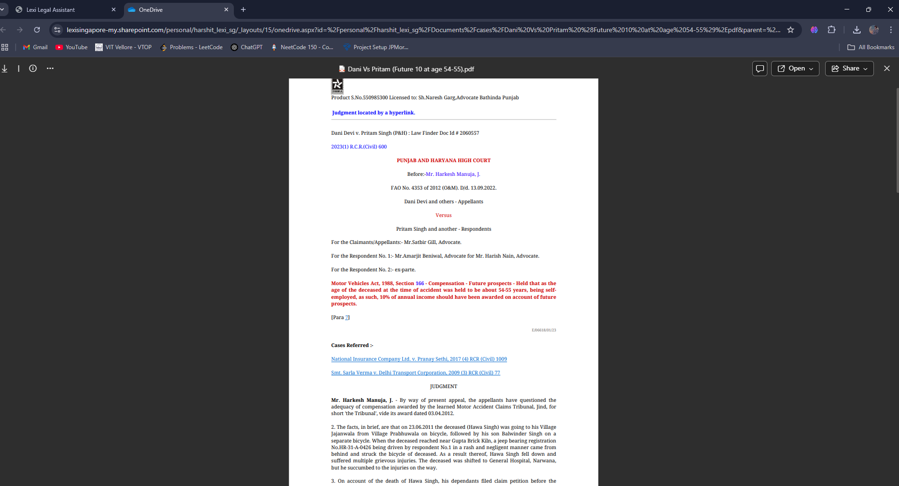

⚖️ LexiSG Frontend Intern Test

A **clean Vite + React** implementation of the **Lexi Legal Assistant**, built as part of the Lexi Frontend Intern Task.

 How to run the project locally

1️. Clone the repository:
```
git clone https://github.com/Sanjayy-afk/lexisg-frontend-intern-test.git
cd lexisg-frontend-intern-test 
```
2️. Install dependencies:
```
npm install
```
3️. Run the project:
```
npm run dev
```
Screenshot



 Citation Linking Handling

- Each citation is displayed below the AI-generated answer with relevant text and the document source.
- Citations are linked using:

  ```jsx
  <a
    href={c.link}
    target="_blank"
    rel="noopener noreferrer"
    className="text-blue-600 underline"
  >
    {c.source}
  </a>

- Clicking a citation opens the SharePoint-hosted PDF document in a new tab for user review, respecting SharePoint’s security restrictions.

- This ensures clean user experience while enabling easy reference to source documents.
